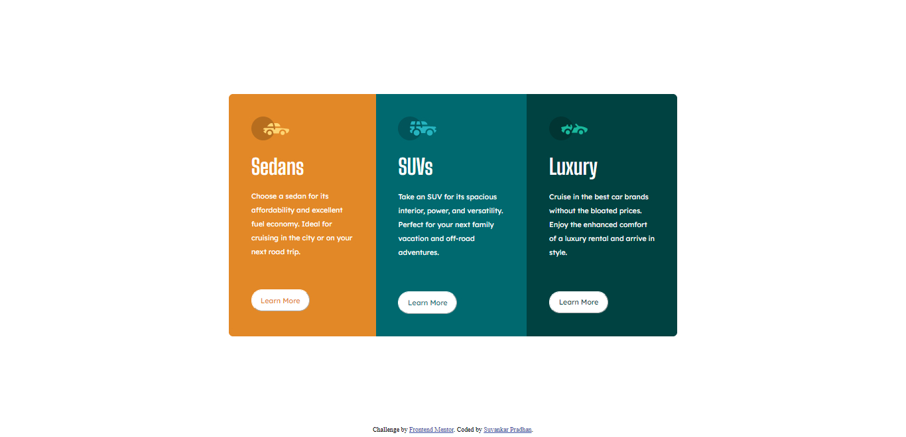

# Frontend Mentor - 3-column preview card component solution

This is a solution to the [3-column preview card component challenge on Frontend Mentor](https://www.frontendmentor.io/challenges/3column-preview-card-component-pH92eAR2-). Frontend Mentor challenges help me improve my coding skills by building realistic projects.

## Table of contents

- [Overview](#overview)
  - [The challenge](#the-challenge)
  - [Screenshot](#screenshot)
  - [Links](#links)
- [My process](#my-process)
  - [Built with](#built-with)
  - [What I learned](#what-i-learned)
- [Author](#author)

## Overview

This is a solution of frontendmentor's challenge. HTML and CSS areused to solve this challenge.

### The challenge

Users should be able to:

- View the optimal layout depending on their device's screen size
- See hover states for interactive elements

### Screenshot

### Links

- Solution URL: [Click here](https://github.com/suvankarpradhan/3-column-preview-card-component)
- Live Site URL: [Click here](https://suvankarpradhan.github.io/3-column-preview-card-component/)

## My process

First create a html and css file and link them. In html file I create the structure of 3-column preview card then add some classes for using css.

### Built with

- Semantic HTML5 markup
- CSS custom properties
- Flexbox

### What I learned

By doing this challenge, I am able to know about my html and css skill.

## Author

- Frontend Mentor - [@suvankarpradhan](https://www.frontendmentor.io/profile/suvankarpradhan)
